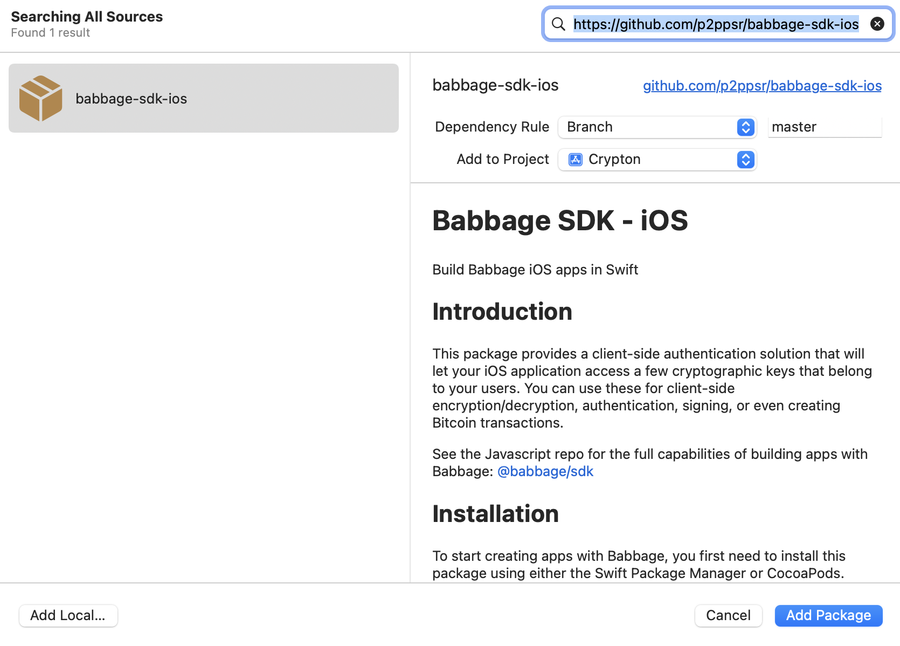

# Babbage SDK - iOS
 Build Babbage iOS apps in Swift

## Introduction

This package provides a client-side authentication solution that will let your iOS application access a few cryptographic keys that belong to your users. You can use these for client-side encryption/decryption, authentication, signing, or even creating Bitcoin transactions.

See the Javascript repo for the full capabilities of building apps with Babbage: [@babbage/sdk](https://github.com/p2ppsr/babbage-sdk)

## Installation

To start creating apps with Babbage, you first need to install this package using either the Swift Package Manager or CocoaPods.

### Using the Swift Package Manager (SPM)
* Right click on your Xcode project and select **``Add Packages``** from the drop-down menu. 
* Next, copy and paste the GitHub URL for this repo, select the current version, and click **``Add Package``**.




### Using CocoaPods
* To install this package using cocoapods, simply follow the instructions outlined on their website: https://guides.cocoapods.org/using/using-cocoapods.html

Make sure the package dependencies have actually been added to your project once this step is complete to prevent possible build errors.

## Example Usage

Here is an example usage from the example app [Crypton](https://github.com/p2ppsr/crypton-ios).

```swift
import UIKit
import WebKit

// Import the BabbageSDK package after adding it your project.
import BabbageSDK

// Controller responsible for handling interactions on the main view
class ViewController: UIViewController {

    @IBOutlet var textView: UITextView!

    // Define the protocol and key IDs that you want to use for your app.
    let PROTOCOL_ID = "crypton"
    let KEY_ID = "1"

    // This should be a shared instance for all view controllers and passed around via segues
    var sdk:BabbageSDK = BabbageSDK(webviewStartURL: "https://staging-mobile-portal.babbage.systems")

    override func viewDidLoad() {
        super.viewDidLoad()
        // Tell the SDK what the parent view is so the webview can be displayed.
        sdk.setParent(parent: self)
    }
    
    // REQUIRED button: Show/hide the Babbage Desktop webview
    @IBAction func showWebView(_ sender: Any) {
        sdk.showView()
    }

    // Encrypts the text from the textview
    @IBAction func encrypt(_ sender: Any) {
        Task.init {
            textView.text = await sdk.encrypt(plaintext: textView.text, protocolID: PROTOCOL_ID, keyID: KEY_ID)
        }
    }
    // Decrypts the text from the textview
    @IBAction func decrypt(_ sender: Any) {
        Task.init {
            textView.text = await sdk.decrypt(ciphertext: textView.text!, protocolID: PROTOCOL_ID, keyID: KEY_ID)
        }
    }
}
```

## API

**Note:** All SDK functions must be called within a ```Task.init``` block as shown above.

### encrypt

Encrypts data with a key belonging to the user. If a counterparty is provided, also allows the counterparty to decrypt the data. The same protocolID, and keyID parameters must be used when decrypting.

#### Parameters

*   `args.plaintext` **([string]()** The data to encrypt. If given as a string, it will be automatically converted to a base64 format.
*   `args.protocolID` **([string]()** Specify an identifier for the protocol under which this operation is being performed.
*   `args.keyID` **[string]()** An identifier for the message being encrypted. When decrypting, the same message ID will be required. This can be used to prevent key re-use, even when the same two users are using the same protocol to encrypt multiple messages. It can be randomly-generated, sequential, or even fixed.
*   `args.description` **[string]()?** Describe the high-level operation being performed, so that the user can make an informed decision if permission is needed. (optional, default `''`)

Returns **[String]()>** The encrypted ciphertext.

### decrypt

Decrypts data with a key belonging to the user. The same protocolID, keyID, counterparty and privileged parameters that were used during encryption must be used to successfully decrypt.

#### Parameters

*   `args.ciphertext` **([string]()** The encrypted data to decipher. If given as a string, it must be in base64 format.
*   `args.protocolID` **([Array]())** Specify an identifier for the protocol under which this operation is being performed. It should be the same protocol ID used during encryption.
*   `args.keyID` **[string]()** This should be the same message ID used during encryption.
*   `args.description` **[string]()?** Describe the high-level operation being performed, so that the user can make an informed decision if permission is needed. (optional, default `''`)

Returns **[String]())>** The decrypted plaintext.

More capabilities such as createAction, and createHmac coming soon!

## License

The license for this library, which is a wrapper for the proprietary Babbage API, is the Open BSV License. It can only be used on the BSV blockchain. The Babbage API itself, including the rights to create and host Babbage software or any other related infrastructure, is not covered by the Open BSV License and remains proprietary and restricted. The Open BSV License only extends to the code in this repository, and you are not permitted to host Babbage software, servers or create copies or alternative implementations of the proprietary Babbage API without other permission.